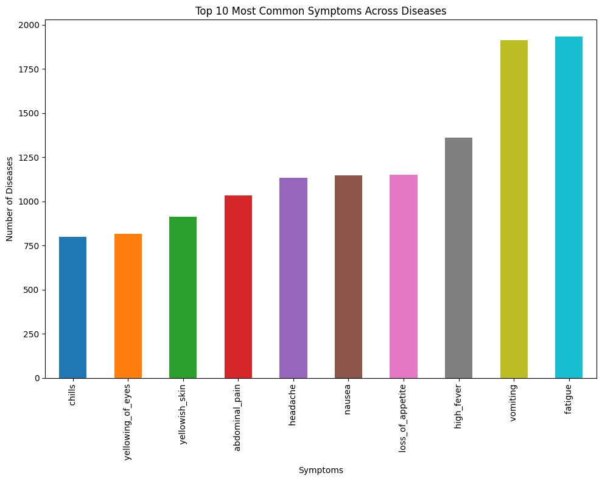
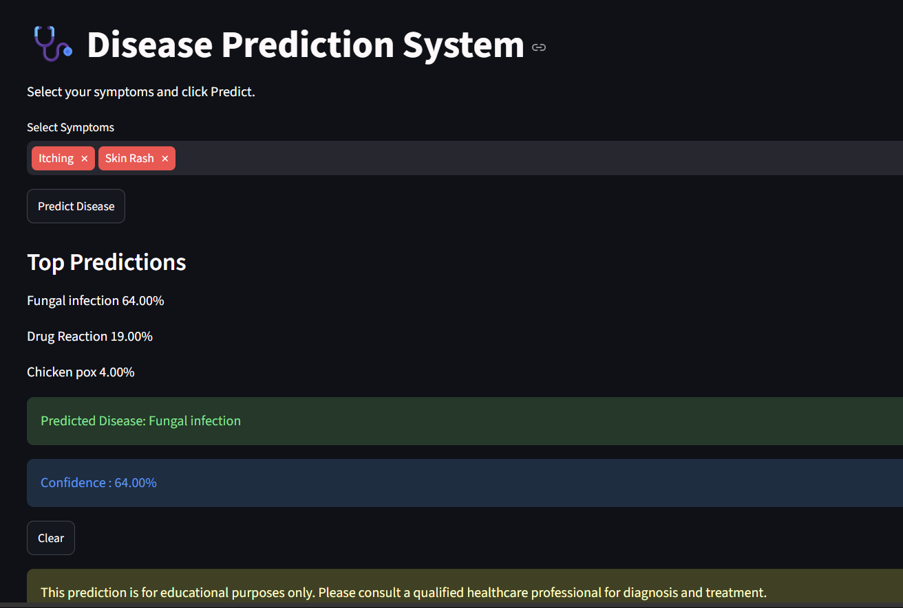

# 🩺 Disease Prediction System

A Machine Learning-based Disease Prediction System that predicts the most likely disease based on symptoms selected by the user. The application provides a simple and interactive interface for quick disease prediction using a trained Random Forest model.

---

## 🚀 Features

* Predicts diseases from user-selected symptoms
* Interactive and user-friendly Streamlit interface
* Trained using the **Random Forest** algorithm
* Fast and accurate predictions
* Easy to use and deploy

---

## 🛠️ Tech Stack

* **Python**
* **Streamlit**
* **Scikit-learn**
* **Pandas**
* **NumPy**
* **Joblib**

---

## 🤖 Machine Learning Model

* **Algorithm:** Random Forest Classifier
* **Model Accuracy:** **100% (1.0)**

> **Note:** This accuracy was achieved on the dataset used for training and testing. Real-world performance may vary depending on the quality and diversity of input data.

---

## 📊 Dataset Analysis

### Top 10 Most Frequent Symptoms





---

## 📁 Project Structure

```text
Disease-Prediction-System/
│── app.py
│── model.pkl
│── symptoms.pkl
│── label_encoder.pkl
│── requirements.txt
│── image/
│   └── symtom_comparision.png
    └── preview.png
│
│── README.md
```

---

## ▶️ Installation

```bash
git clone https://github.com/your-username/Disease-Prediction-System.git
cd Disease-Prediction-System
pip install -r requirements.txt
streamlit run app.py
```

---

## 📷 Application Preview



---

## 📌 Future Improvements

* Disease probability scores
* Medicine recommendation
* Doctor consultation suggestions
* Multi-language support
* Health report generation

---

## 👨‍💻 Author

**Shubhankar Mishra**
